# PROJETO CYBERFLOW

**Integrantes do grupo:**  
- BIANCA PEREIRA MOREIRA N3
- EMANUEL MORAES ALMEIDA N6
- GIOVANNA GABRIELLY BURDA N8
- MAYKON DA COSTA SALVADOR N22
- ALAN CORDEIRO MARTINS N29

---
## Link do Protótipo no Figma

#### [CLIQUE AQUI ⊹ ࣪ ˖](https://www.figma.com/design/Rz1DUMhDxURiwI04CMQnrp/cyberflow?m=auto&t=moX9mbCpmH5n6nJ6-6)
--- 

## API Utilizada

DEEZER API  
[CLIQUE AQUI ⊹ ࣪ ˖](https://developers.deezer.com/api)

#### *Páginas com consumo de APIs* 
- Tela Inicial (Bianca P.);
- Biblioteca (Giovanna G.).

## *Observação* 

#### Em determinadas páginas não há utilização de API, sendo elas: 
- Álbum/Reprodução (ALAN) - Não há uso de APIs externas para reprodução de músicas (Por recomendação do professor), pois, foi verificado em outras turmas que a utilização de APIs relacionadas a reprodução de músicas, de forma geral, apresentava erros.
- Pesquisa (MAYKON) - A aplicação em JavaScript não retornava respostas, assim, optou por manter sem.
- Perfil (EMANUEL) - Não participou ativamente do projeto.
---

## Tecnologias Usadas

- HTML
- CSS
- JAVASCRIPT
- BOOTSTRAP
- API
- POSTMAN (Teste da API)
- FIGMA (Prototipagem)

## Sobre o App

Este é um app de música com uma estética futurista e interface altamente intuitiva. Ele foi desenvolvido com o objetivo de despertar no usuário a curiosidade e o interesse em explorar ao máximo todas as funcionalidades disponíveis.

Principais funcionalidades:
- Sistema de recomendações (artistas,músicas e etc).
- Campo de busca de albúns e artistas.
- adaptação a diferentes dispositivos.

---

## App em Funcionamento

### Tela 1 (login-Bianca P.)

### Tela em Modo responsivo  
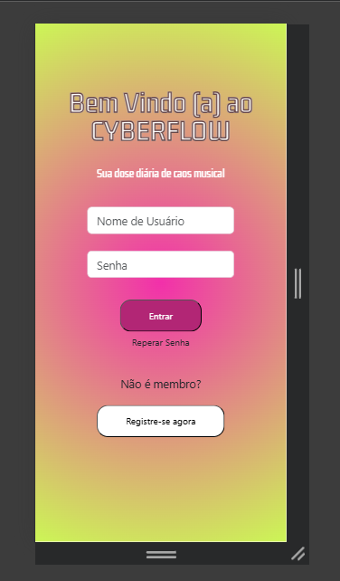

## Descrição
- Possui tela de autenticação com campos para usuário e senha, e
opções para "Esqueci minha senha" e registro de novos usuários.

## Para quais funcionalidades foi pensada
- Foi pensada para possuir um Login seguro, link para recuperação de senha e redirecionamento para cadastro de novos membros.

## Observações
- O design foi feito pensado priorizando simplicidade e usuabilidade.

## Problemas enfrentados durante projeto

#### De forma geral, o maior problema enfrentado durante a codificação da página inicial, foi o gradiente utilizado no fundo. Por nunca ter feito algo mais complexo do que colocar uma imagem no fundo, o gradiente foi uma das minhas maiores dificuldades. Outro problema foi a centralização das *div's*, que foram resolvidos com o uso do *Flexbox*.

### Solução para o gradiente de fundo

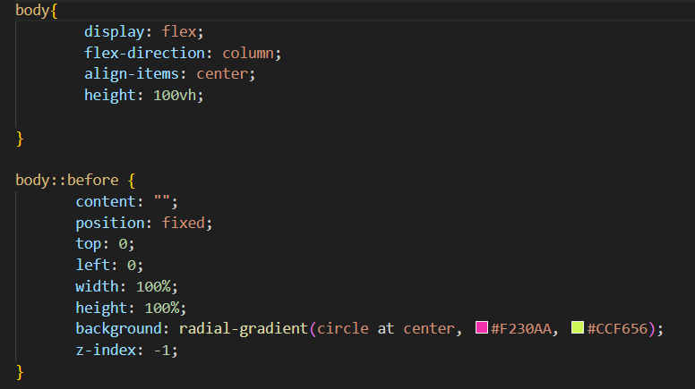
---

## Tela 2 (página inicial-Bianca P.)
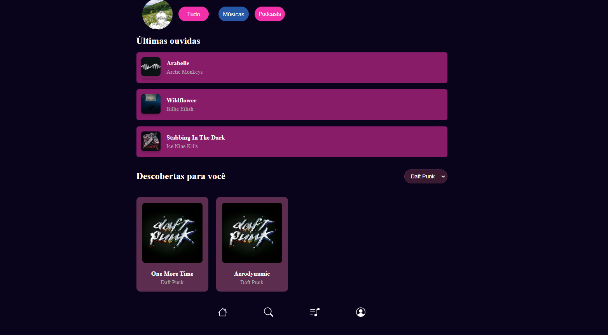

## Tela em Modo responsivo  
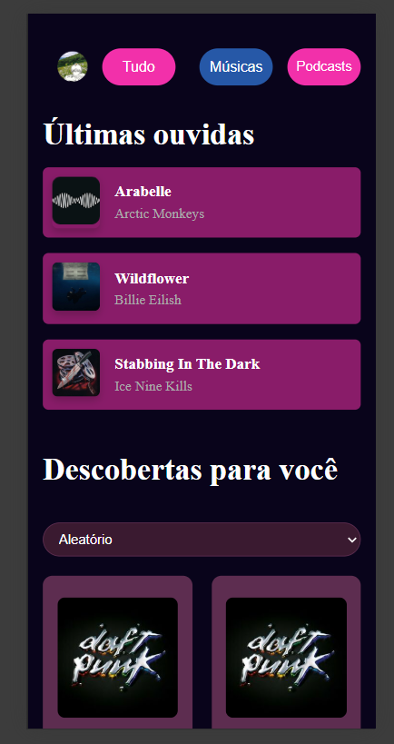

### Para quais funcionalidades foi pensada
- Foi programado para apresentar histórico Personalizado que exibe as últimas músicas reproduzidas, e recomendações baseadas nas preferências do usuário.

## Seções Principais
### Campo superior da tela inicial tirada em modo responsivo 

**Botões e suas funções**

**Foto de perfil** - ícone no canto superior esquerdo, foi usado uma imagem para simbolizar o perfi/conta do usuário.

**Tudo** - botão usado para representar a tela inicial como um todo, sendo a primeira página a aparecer após a tela de login.

**Músicas** - usado para representar um botão que conecta a tela inicial com a área de pesquiade.

**Podcasts** - usado para representar um botão que conecta com área da biblioteca.

### Músicas

- Nessa seção são representados as últimas três músicas que o usuário escutou recentemente (imagens meramente ilustrativas).

## Seção inferior e navbar
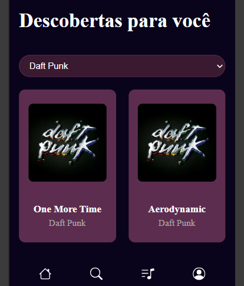
- Mostra duas músicas baseadas em quatro opções.
--- 

## Opções de Músicas
Como aparece em tela de computador/telas grandes.

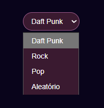

Como aparece em modo responsivo/telas pequenas.

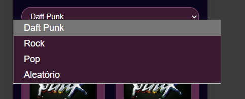

### O que ela retorna ao escolher um opção
 Todas retornam duas músicas de um mesmo artista.

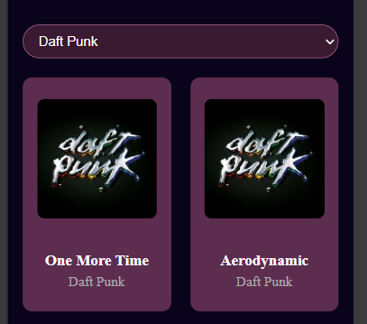

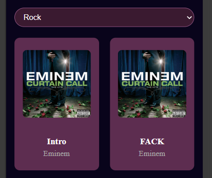

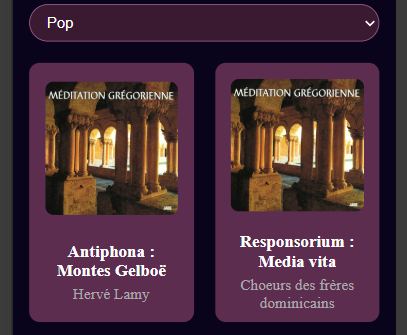

.png)

### API utilizada
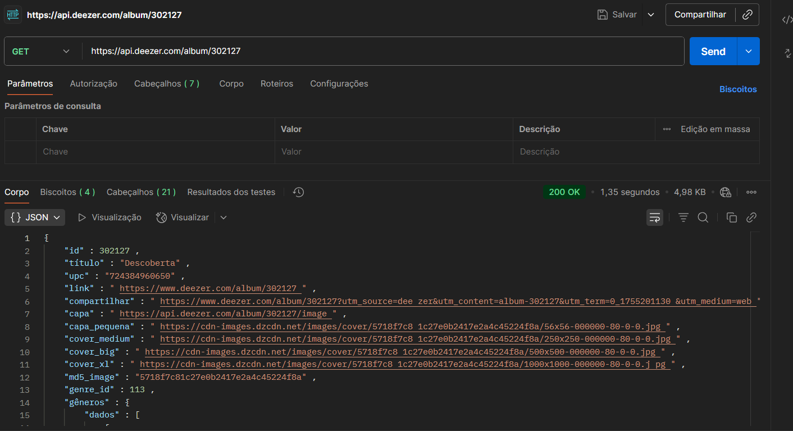
- API testada para certaza da funcionalidade e comprovação de sua eficácia, retornando a capa das músicas, com seus respectivos nomes e artistas/criadores.

### Navbar
- Pensada para se adaptar em telas de direntes tamanhos, e botões que direcionam o usuáro para as outras páginas do projeto.

## Problemas enfrentados durante projeto

#### Durante a codificação do projeto foram enfrentados problemas com a responsividade do aplicavo, sendo um problema recorrente a centralização das *div's*, como tentativa de solução foram empregados códigos do Flexbox, que se mostraram eficentes. Para resolver o problema de adaptação em diferentes tamanhos de telas foi usado o *midia query*. 

### Diferenças com o protótipo do *Figma*

#### No processo de criação do protótipo foram pensadas três seçõs que iriam compor toda a extensão da tela incial. A segunda seção seria a das *Playlists* que estaria localizada no centro da tela, entretanto, apresentei muita dificuldade em criar e acertar o tamanho e posicionamento das imagens e blocos em que as mesmas estariam inceridas, não estava entendo como deveriam ser criados os *conteiners* e qual seria o seu comportamento, por esse fato, optei por abandonar essa parte do protótipo.

### Imagem da segunda seção

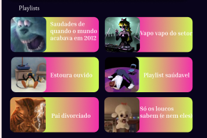
--- 

### Tela 3 (Área de pesquisa-Maykon)

### Tela de Resultados  

#### Eu pensei em base no projeto que fizemos no figma, tentei fazer o mais fiel possivel ao esboço inicial, talvez e tenha sonhado muito alto mas eu acho que consegui deixa parecido. O objetivo da minha página é mostrar os artistas mais em alta e também ser uma aba de pesquisa para você conhecer novos artistas e descobrir novos gostos musicais.

## EXPLICAÇÃO DAS FUNCIONALIDADES.
#### Nessa parte eu pensei em fazer uma barra de pesquisa para o usuário conhecer novos artistas ou buscar seus artistas favoritos.

#### Nessa parte do meu projeto eu usei de referencia algumas abas do spotfy em que ele recomenda os "top artistas" mais ouvidos, claro q eu so coloquei artistas que gosto, não tem nenhum dado estatístico sobre os ouvintes desses artistas.

#### A navbar foi uma decisao conjunta entre os membros da equipe, na qual tem a funcionalidade de transitar entre as páginas tendo uma navegação dinâmica e fluída
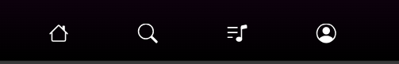

---

### Tela 4 (Biblioteca - Giovanna)

 #### TELA - modo responsivo

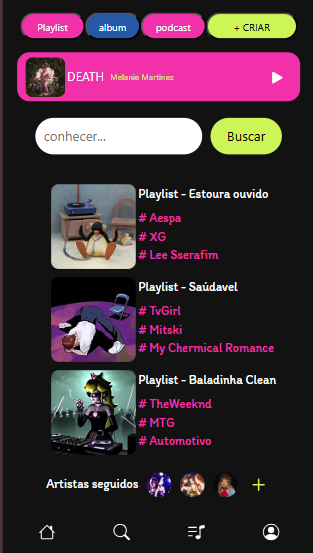

#### TELA - modo desktop

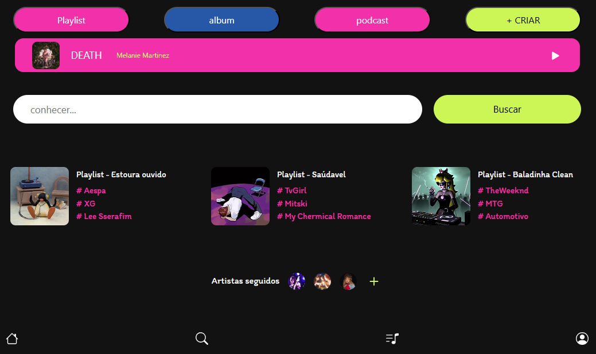

---

### Tela de Resultados  
### API - implementação e resultado no front-end

#### POSTMAN/ teste da API

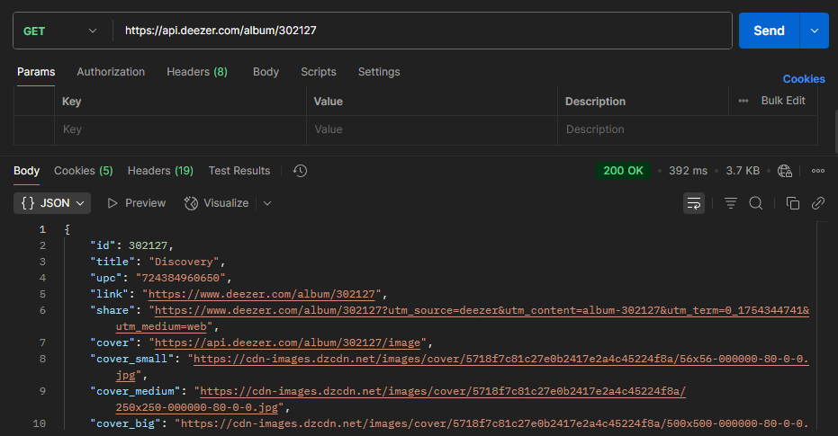

#### Os endpoints da API foram testados no Postman para validar seu funcionamento e as respostas retornadas. Isso garantiu que a API escolhida estivesse apresentando resultados e não possíveis erros que comprometesse a aplicação.

---

#### RESULTADOS DA API/ front-end

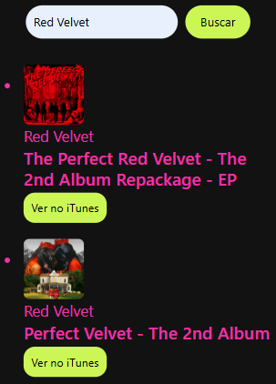

#### Após a implementação da API em JavaScript, o sistema retorna uma prévia de álbuns com base na pesquisa do usuário. Os resultados incluem:

- Capa do álbum (imagem)

- Nome do artista

- Título do álbum

- Botão de ver no Itunes

#### Ao clicar no botão, redireciona o usuário para a página do álbum no iTunes, onde é possível ouvir uma prévia das faixas.

#### Exemplo:

 

#### No final dos resultados temos os botões de próximo e anterior para mais resultados!

---

### BOTÕES E FUNÇÕES

#### Botões superiores e player de música

#### Barra Superior - Navegação Principal
- Playlists: Exibe as playlists criadas pelo usuário.

- Álbuns: Mostra os álbuns de artistas baixados pelo usuário.

- Podcasts: Apresenta os podcasts baixados pelo usuário.

- Criar: Permite ao usuário criar novas playlists personalizadas.

#### Seção Inferior - Player de Música
 - Exibe a última música reproduzida ou a música atual em execução.

 - Permite que o usuário retome a reprodução de onde parou, com controles básicos de player (play/pause).

---

 #### Barra de pesquisa e playlists

 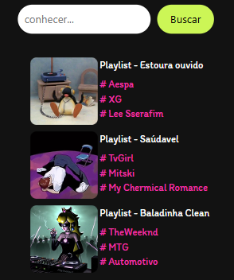

#### Botão de pesquisa

- Campo de Pesquisa: Onde o usuário digita sua busca (integrado com a API).

- Botão de Busca: Envia a consulta ao servidor para processamento e retorno dos resultados.

 #### Playlists

- Capa da Playlist

- Imagem personalizada escolhida pelo usuário ao criar a playlist.

- Informações Básicas

- Nome da Playlist: Título atribuído pelo usuário.

- Hashtags: Tags que indicam automaticamente os principais artistas presentes na playlist (geradas com base no conteúdo dos álbuns adicionados).

---

#### Artistas seguidos e navbar

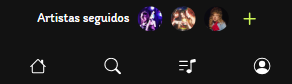

#### Artistas seguidos

- Exibe os artistas que o usuário está seguindo em formato de lista contendo a foto do artista.

- Adiciona novos artistas no ícone "+".

- ao clicar na foto do artista o usuário é levado até o perfil do artista.

#### Navbar

- Design responsivo que se adapta a diferentes telas.

- Ícones intuitivos para melhor experiência do usuário.

- Navegação fluida entre as seções do app.

- Observação:
A barra de navegação permanece fixa em todas as páginas, garantindo acesso rápido às principais funcionalidades.

---

#### Pontos importantes!

#### * Dentro do código html foi utilizado alguns códigos para melhorar a acessibilidade, algumas Interação em JavaScript (simples) e a indentação do código.

#### * Possui respostas de erro no JavaScript caso o user digite algo errado ou não existente da API!

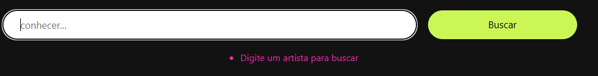
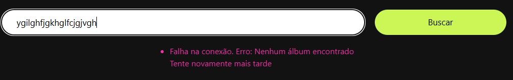

#### * Durante o projeto ocorreram alguns erros com a API anterior por estar offline e ser considerada "instável", e o código não estar se adaptando para a tela de desktop.Contudo, tais erros foram arrumados com a utilização de uma API pública e conhecida, e ouve a utilização do Media Queries para a adaptação da tela corretamente.

---

### Tela 5 (Artista/Playlist por dentro - Alan)

### TELA - modo Responsivo

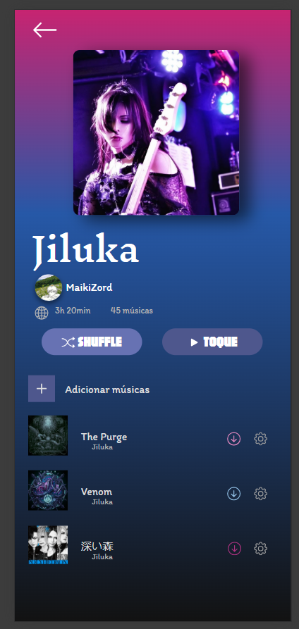
---

### TELA - modo desktop 

---

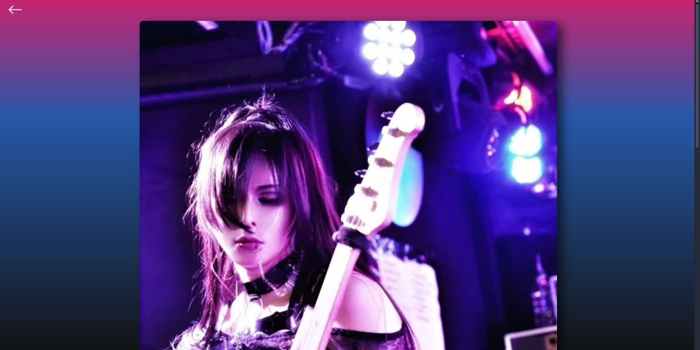
---

## Problemas enfrentados durante o projeto.
#### De forma geral, um dos problemas que tive durante a criação do projeto foi a centralização de div, na qual em alguns elementos tive que deixar de lado, pois estava demorando tanto para conseguir centralizar que acabei deixando da maneira que estava. Em alguns casos consegui resolver através do flexbox, outro problema foi na questão das medias queries, não consegui fazer com que funcionasse para modo desktop, funcionando apenas para celulares/tablets. 

---

## Para quais funcionalidades foi pensada
- Exibição do nome do álbum e capa (imagem)
- Listagem das músicas do álbum com seus títulos.
---
## Observações 

- O Design foi pensado e feito de forma com que o usuário se sentisse confortavel, usando cores que combinassem com o álbum.
- Diferente do protótipo do figma, não foi colocado a ygona. 
---

### Tela 6 (Reprodutor de música - Alan)

### TELA - modo responsivo 
---
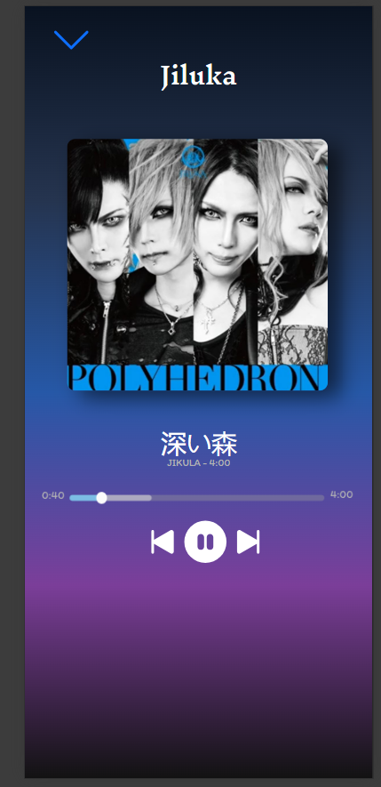
---

### TELA - modo desktop
---
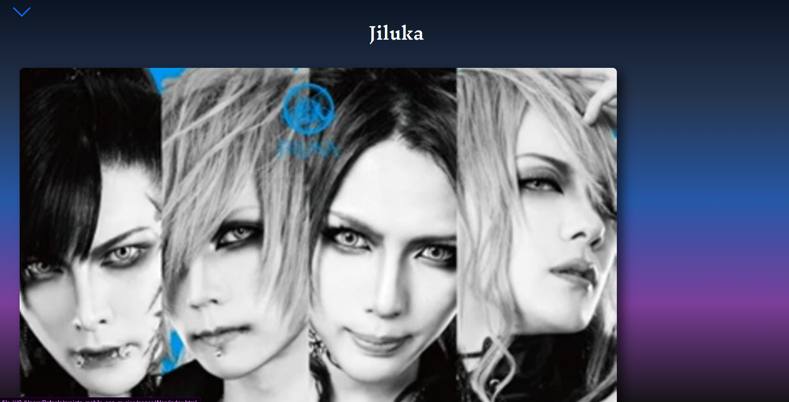
---

## Problemas enfrentados durante o projeto.
### Não consegui fazer com que quando clicasse no icon (De pause e play) a música pudesse tocar.Outro problema que eu encontrei, que consegui resolver na minha outra página (do Álbum) foi quando coloquei um link usando a tag "a" a cor original do item foi mudada para azul, mas infelizmente nessa página não fui capaz de resolver e acabei optando por deixar azul ao invés da cor original branca. E as medias queries tive novamente o mesmo problema de não conseguir adaptar para o modo desktop. 
---
## Foto do problema. 

---
- O link foi pensado para que quando clicasse nesse icon voltasse para a minha outra tela que era o Álbum.
## Para quais funcionalidades foi pensada 
- Para que pudesse dar play, pause ou passar para a proxima música.
---
## Observações 
- Não há uso de APIs externas para reprodução de música.
- A parte dos minutos da música foi usado uma print para simular. 
- Teve algumas mudanças que optei fazer diferente do figma como diversos botões que havia de configuração, curtida etc... que resolvi não colocar pois atrasaria o projeto.
---
### Tela 7 (Perfil do usuário - Emanuel)

## NÃO CONTRIBUIU COM O PROJETO

---
